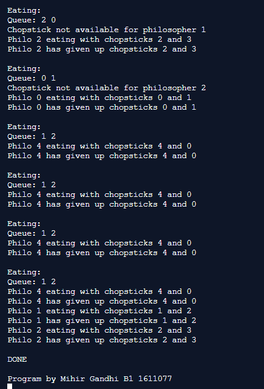

## Banker's Algorithm

-----------------------------------------
### Problem Definition:
Write a program to implement Banker's Algorithm for Deadlock Avoidance.

------------------------------------------
### Output:

    

    

    

