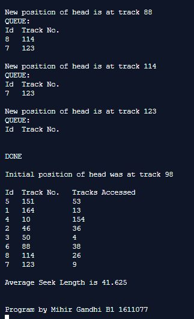

## Disc Scheduling Algorithms - CLOOK

-----------------------------------------
**CLOOK:**

CLOOK is similar to CSCAN disk scheduling algorithm. In CLOOK, the disk arm in spite of going to the end goes only to the last request to be serviced in front of the head and then from there goes to the other end’s last request. Thus, it also prevents the extra delay which occurred due to unnecessary traversal to the end of the disk.

------------------------------------------
### Output:

    

    

