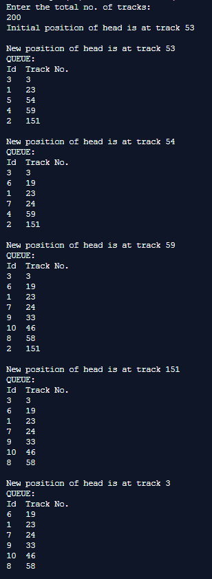
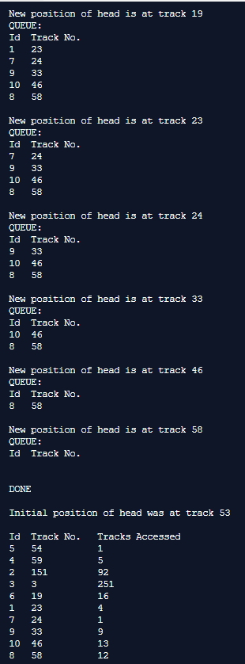
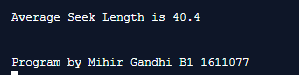

## Disk Scheduling Algorithms - CSCAN

-----------------------------------------
**CSCAN:**

In C-SCAN algorithm, the arm of the disk moves in a particular direction servicing requests until it reaches the last cylinder, then it jumps to the last cylinder of the opposite direction without servicing any request then it turns back and start moving in that direction servicing the remaining requests.

------------------------------------------
### Output:

    

    

    

