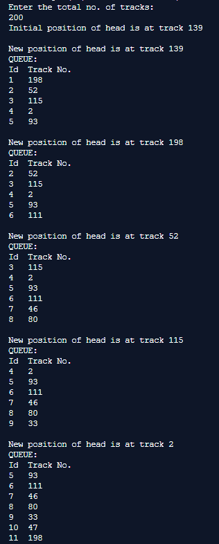
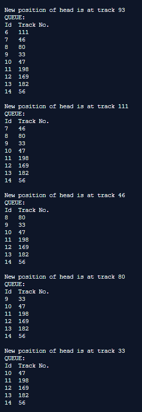
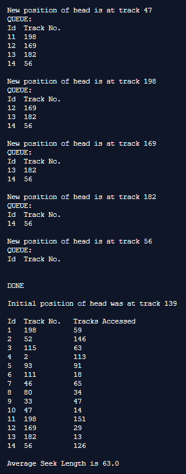

## Disk Scheduling Algorithms - FCFS

-----------------------------------------
**First Come-First Serve (FCFS):**

It is the simplest Disk Scheduling algorithm. It services the IO requests in the order in which they arrive. There is no starvation in this algorithm, every request is serviced.

------------------------------------------
### Output:

    

    

    

