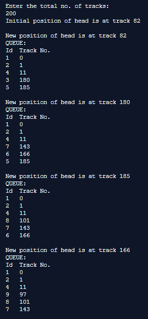
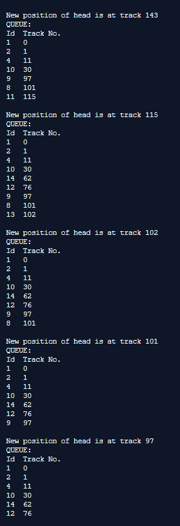
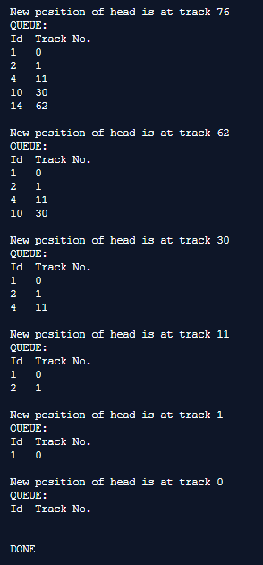
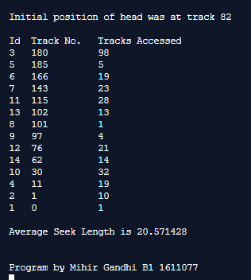

## Disk Scheduling Algorithms - LOOK

-----------------------------------------
**LOOK:**

It is like SCAN scheduling Algorithm to some extent except the difference that, in this scheduling algorithm, the arm of the disk stops moving inwards (or outwards) when no more request in that direction exists. This algorithm tries to overcome the overhead of SCAN algorithm which forces disk arm to move in one direction till the end regardless of knowing if any request exists in the direction or not.

------------------------------------------
### Output:

    

    

    

    

