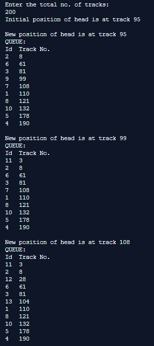
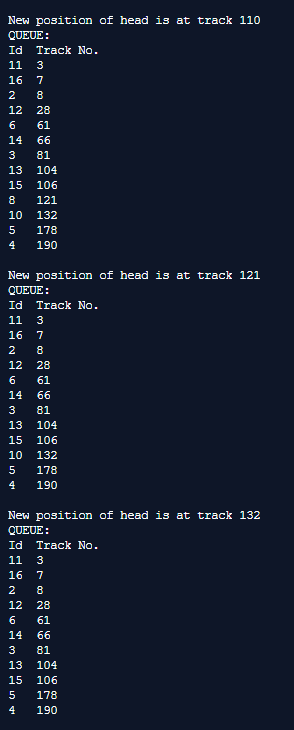
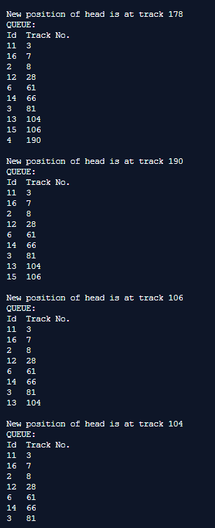
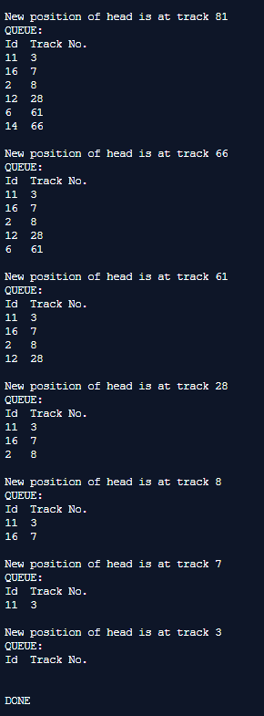
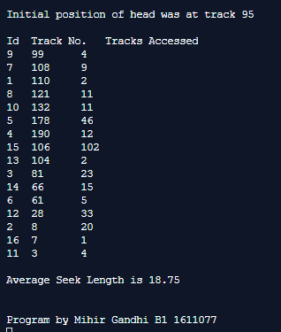

## Disk Scheduling Algorithms - SCAN

-----------------------------------------
**SCAN (Elevator):**

It is also called as Elevator Algorithm. In this algorithm, the disk arm moves into a particular direction till the end, satisfying all the requests coming in its path,and then it turns back and moves in the reverse direction satisfying requests coming in its path. It works in the way an elevator works, elevator moves in a direction completely till the last floor of that direction and then turns back.

------------------------------------------
### Output:

    

    

    

    

    

