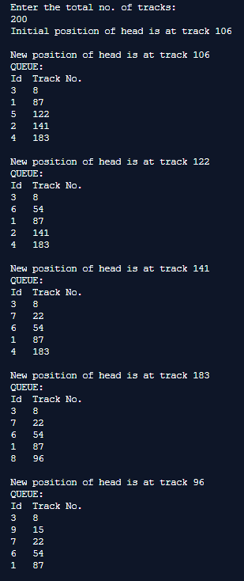

## Disc Scheduling Algorithms - SSTF

-----------------------------------------
**Shortest Seek Time First (SSTF):**

Shortest seek time first (SSTF) algorithm selects the disk I/O request which requires the least disk arm movement from its current position regardless of the direction. It reduces the total seek time as compared to FCFS. It allows the head to move to the closest track in the service queue.

------------------------------------------
### Output:

    

    

    

