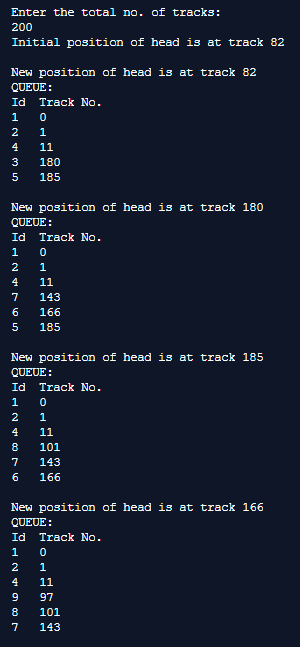
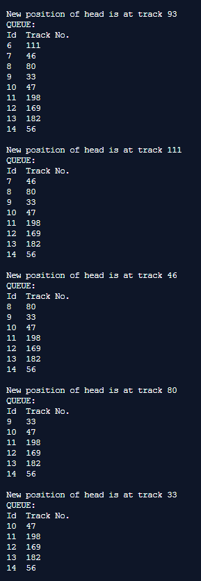
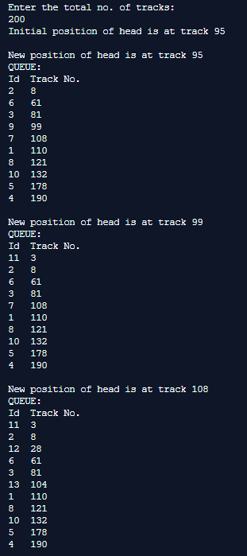
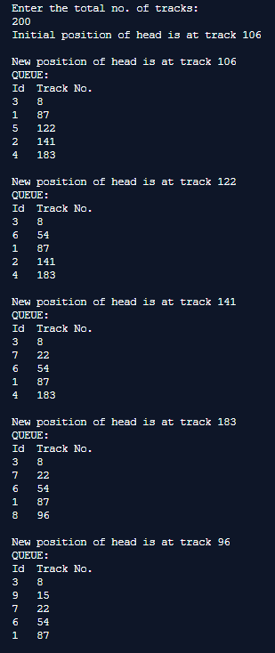

## Disc Scheduling Algorithms

-----------------------------------------
### Problem Definition:
Write a program to implement following Disk Scheduling Algorithms: FCFS, SSTF, SCAN, CSCAN, LOOK.

**First Come-First Serve (FCFS):**
It is the simplest Disk Scheduling algorithm. It services the IO requests in the order in which they arrive. There is no starvation in this algorithm, every request is serviced.

**Shortest Seek Time First (SSTF):**
Shortest seek time first (SSTF) algorithm selects the disk I/O request which requires the least disk arm movement from its current position regardless of the direction. It reduces the total seek time as compared to FCFS. It allows the head to move to the closest track in the service queue.

**Elevator (SCAN):**
It is also called as Elevator Algorithm. In this algorithm, the disk arm moves into a particular direction till the end, satisfying all the requests coming in its path,and then it turns back and moves in the reverse direction satisfying requests coming in its path. It works in the way an elevator works, elevator moves in a direction completely till the last floor of that direction and then turns back.

**CSCAN:**
In C-SCAN algorithm, the arm of the disk moves in a particular direction servicing requests until it reaches the last cylinder, then it jumps to the last cylinder of the opposite direction without servicing any request then it turns back and start moving in that direction servicing the remaining requests.

**LOOK:**
It is like SCAN scheduling Algorithm to some extent except the difference that, in this scheduling algorithm, the arm of the disk stops moving inwards (or outwards) when no more request in that direction exists. This algorithm tries to overcome the overhead of SCAN algorithm which forces disk arm to move in one direction till the end regardless of knowing if any request exists in the direction or not.

------------------------------------------
### Output:

    

    

    

    

