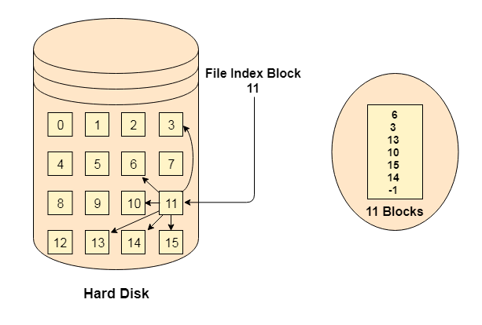
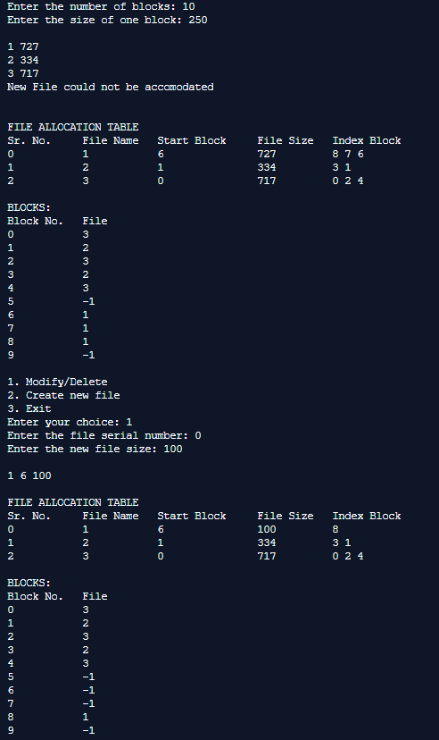
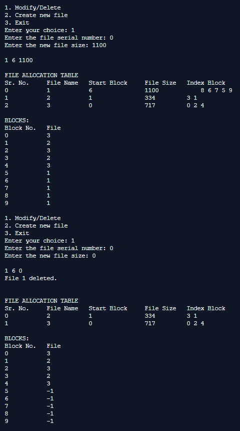
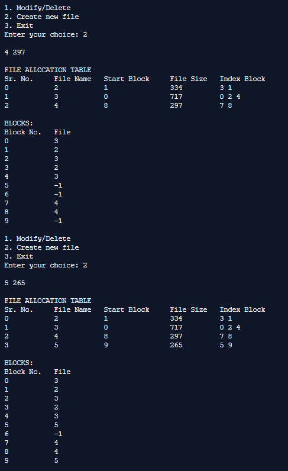

## File Allocation Strategies - Indexed

-----------------------------------------
**Indexed Strategy:**

Instead of maintaining a file allocation table of all the disk pointers, Indexed allocation scheme stores all the disk pointers in one of the blocks called as indexed block. Indexed block doesn't hold the file data, but it holds the pointers to all the disk blocks allocated to that particular file. Directory entry will only contain the index block address.

    

------------------------------------------
### Output:

    

    

    

    

