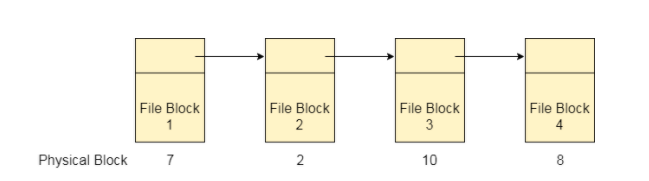
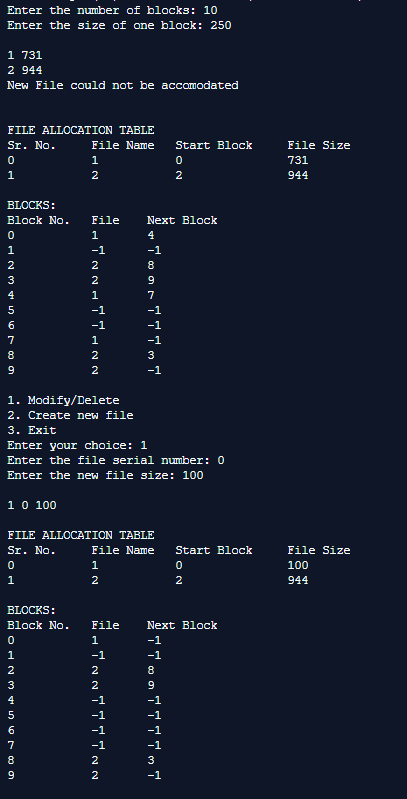
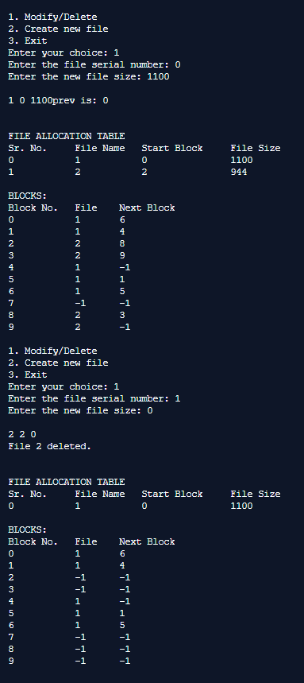
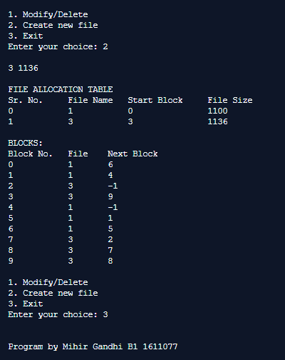

## File Allocation Strategies - Linked

-----------------------------------------
**Linked Strategy:**

Linked List allocation solves all problems of contiguous allocation. In linked list allocation, each file is considered as the linked list of disk blocks. However, the disks blocks allocated to a particular file need not to be contiguous on the disk. Each disk block allocated to a file contains a pointer which points to the next disk block allocated to the same file.

    

------------------------------------------
### Output:

    

    

    

