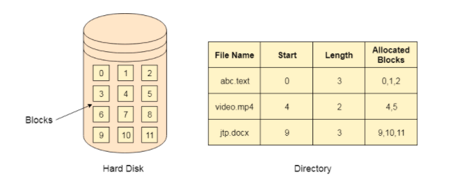
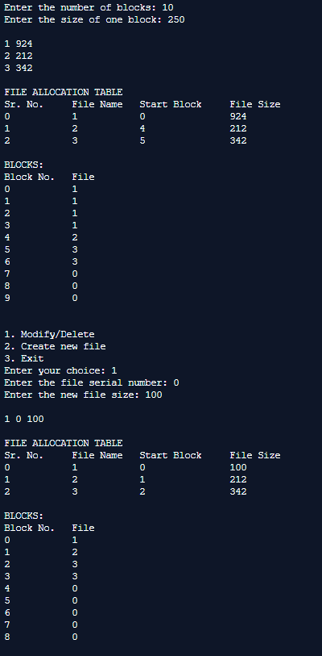
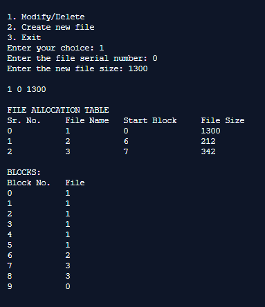
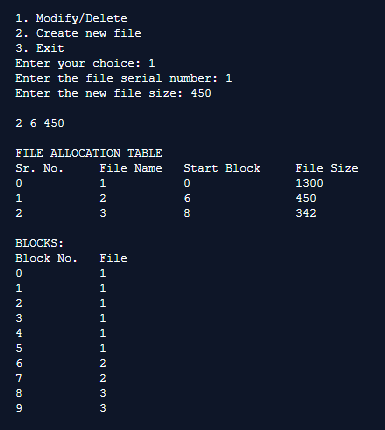
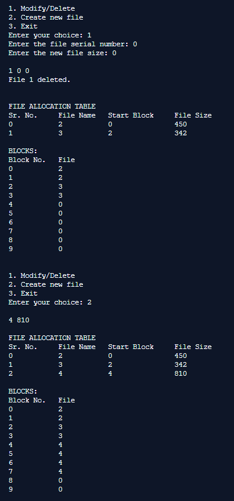
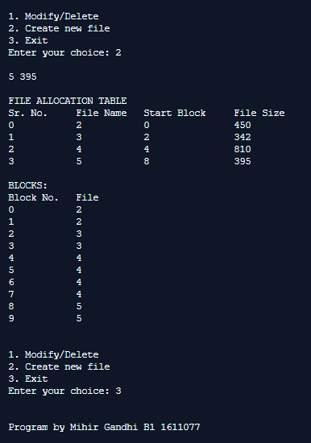

## File Allocation Strategies - Sequential

-----------------------------------------
**Sequential Strategy:**

If the blocks are allocated to the file in such a way that all the logical blocks of the file get the contiguous physical block in the hard disk then such allocation scheme is known as contiguous allocation.

In the image shown below, there are three files in the directory. The starting block and the length of each file are mentioned in the table. We can check in the table that the contiguous blocks are assigned to each file as per its need.

    

------------------------------------------
### Output:

    

    

    

    

    

