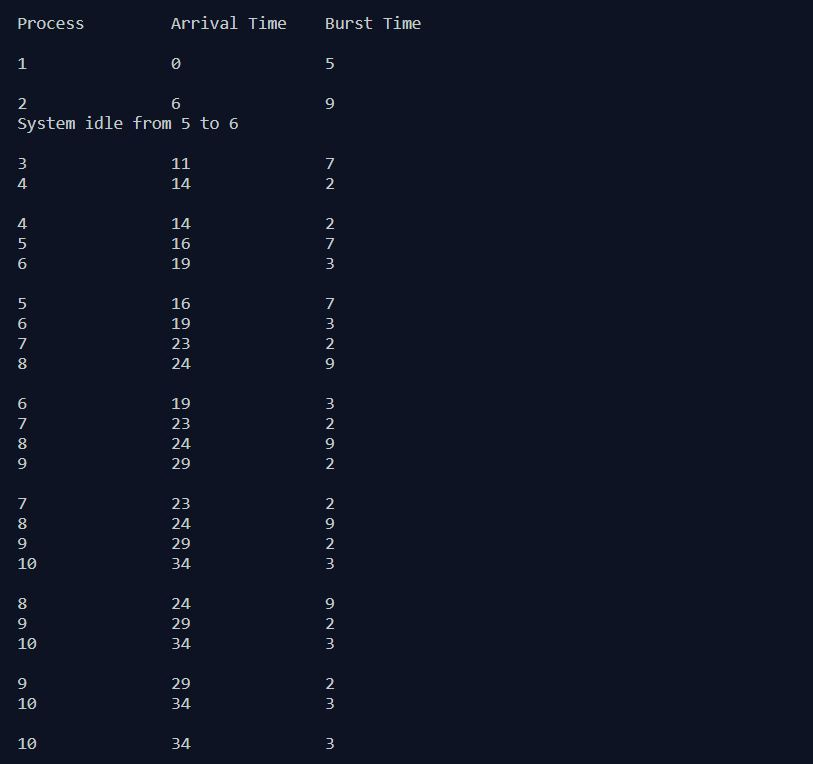
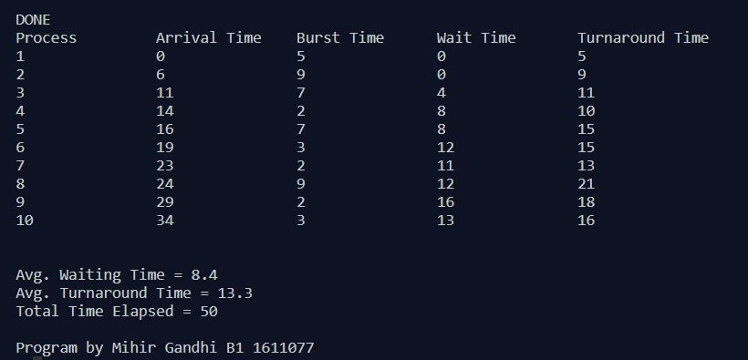

## Non-Preemptive Process Management - FCFS

-----------------------------------------
**FCFS:**

Given n processes with their burst times, the task is to find average waiting time and average turnaround time using FCFS scheduling algorithm. First come, first served (FCFS), also known as first in, first out (FIFO), is the simplest scheduling algorithm. FIFO simply queues processes in the order that they arrive in the ready queue. In this, the process that comes first will be executed first and next process starts only after the previous gets fully executed.

------------------------------------------
### Output:

    

    

