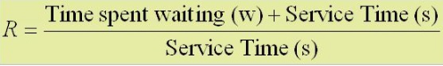
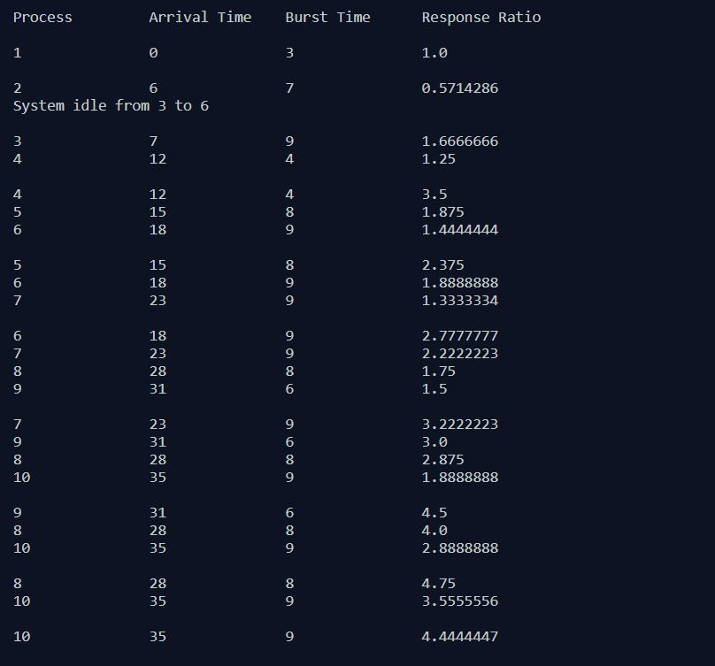
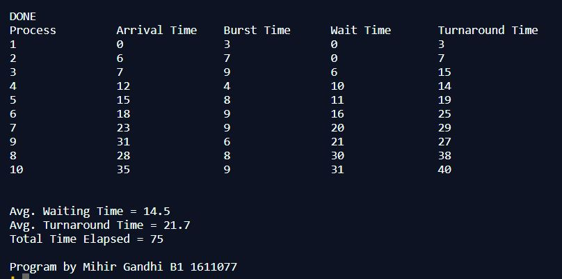

## Non-Preemptive Process Management - HRRN

-----------------------------------------
**Highest Response Ratio Next (HRRN):**

Given n processes with their Arrival times and Burst times, the task is to find average waiting time and average turn around time using HRRN scheduling algorithm. The name itself states that we need to find the Response Ratio (R) of all available processes and select the one with the highest Response Ratio. A process once selected will run till completion.

    

------------------------------------------
### Output:

    

    

