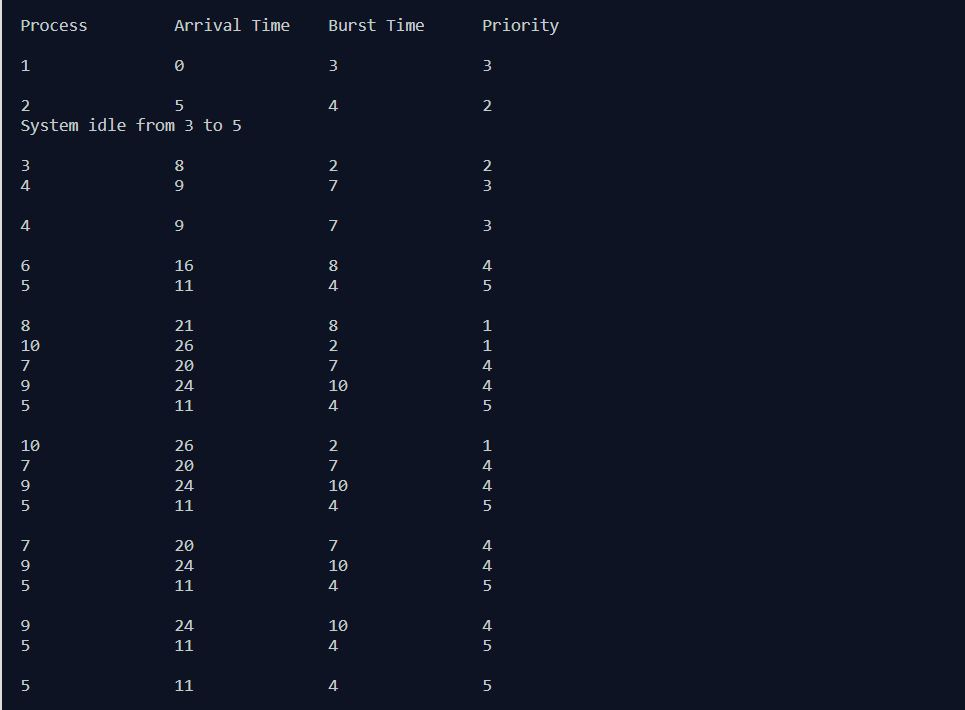
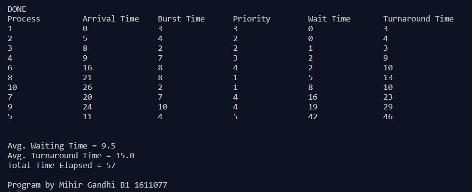

## Non-Preemptive Process Management - Priority

-----------------------------------------
**Priority Scheduling:**

Priority scheduling is a non-preemptive algorithm and one of the most common scheduling algorithms in batch systems. Each process is assigned first arrival time
(less arrival time process first) if two processes have same arrival time, then compare to priorities (highest process first). Also, if two processes have same priority then compare to process number (less process number first). This process is repeated while all process get executed.

------------------------------------------
### Output:

    

    

