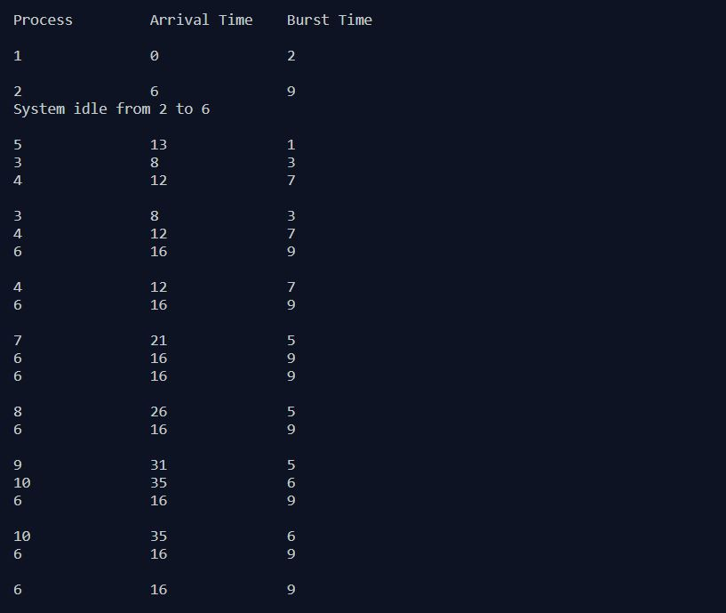
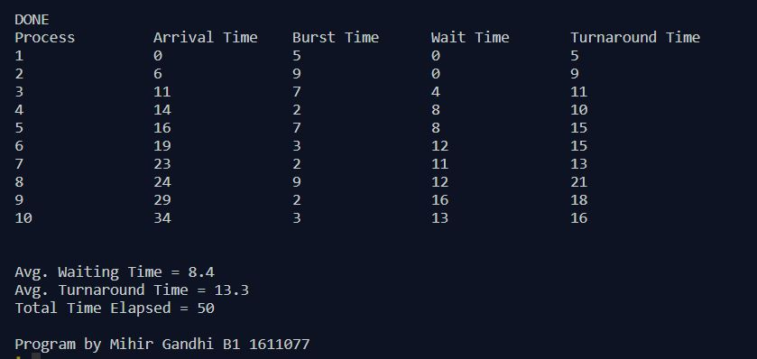

## Non-Preemptive Process Management - SJF

-----------------------------------------
**Shortest Job First (SJF):**

Shortest Job First scheduling works on the process with the shortest burst time or duration first. This is the best approach to minimize waiting time and is used in Batch Systems. This scheduling algorithm is optimal if all the jobs/processes are available at the same time.

------------------------------------------
### Output:

    

    

