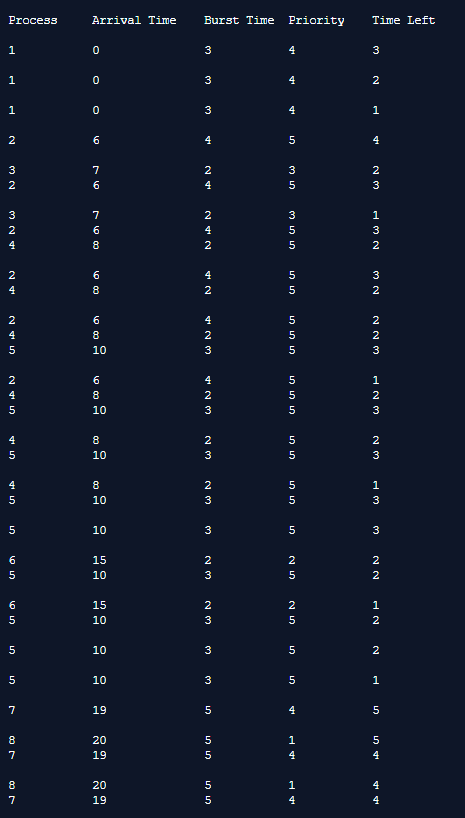
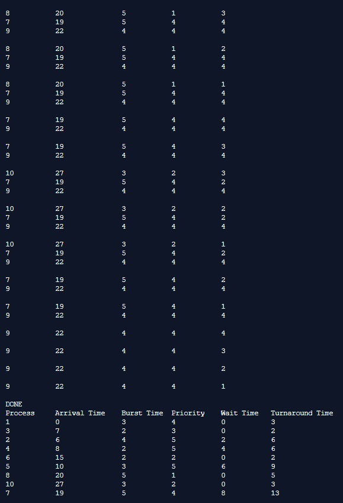

## Preemptive Process Management - Priority

-----------------------------------------
**Priority Scheduling:**

* In Preemptive Priority Scheduling, at the time of arrival of a process in the ready queue, its Priority is compared with the priority of the other processes present in the ready queue as well as with the one which is being executed by the CPU at that point of time. The one with the highest priority among all the available processes will be given the CPU next.

* The difference between preemptive priority scheduling and non preemptive priority scheduling is that, in the preemptive priority scheduling, the job which is being executed can be stopped at the arrival of a higher priority job.

------------------------------------------
### Output:

    

    

    

