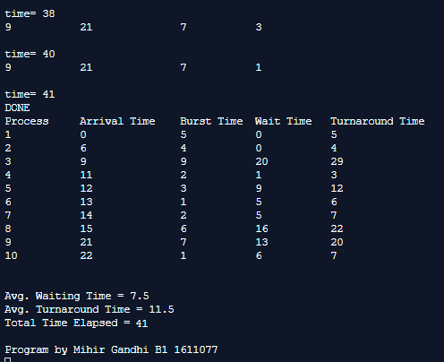

## Preemptive Process Management - Round Robin

-----------------------------------------
**Round Robin:**

* A fixed time is allotted to each process, called quantum, for execution.
* Once a process is executed for given time period that process is preemptied and other process executes for given time period.
* Context switching is used to save states of preemptied processes.

------------------------------------------
### Output:

    

    

    

    

