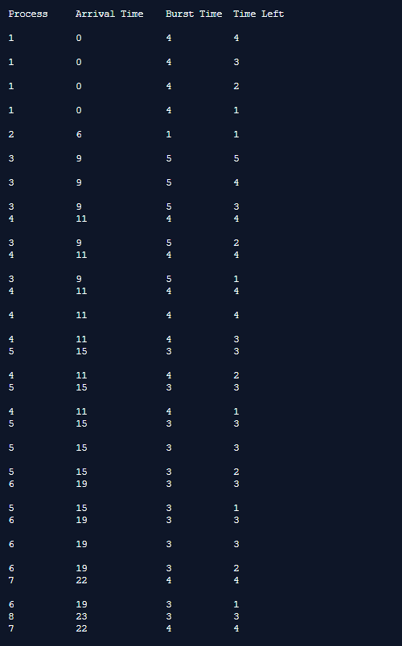
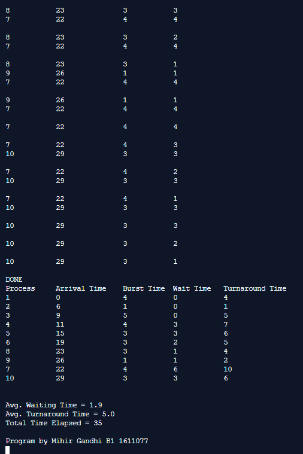

## Preemptive Process Management - SRTN

-----------------------------------------
**Shortest Remaining Time Next (SRTN):**

* Shortest Remaining Time Next (SRTN) is the preemptive version of the SJN algorithm. 
* The processor is allocated to the job closest to completion but it can be preempted by a newer ready job with shorter time to completion.
* Impossible to implement in interactive systems where required CPU time is not known. It is often used in batch environments where short jobs need to give preference.

------------------------------------------
### Output:

    

    

