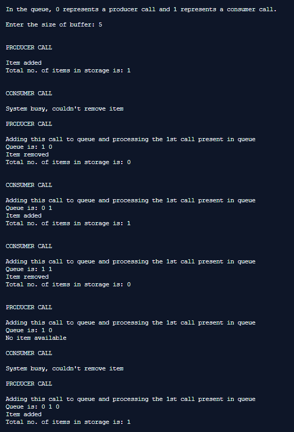
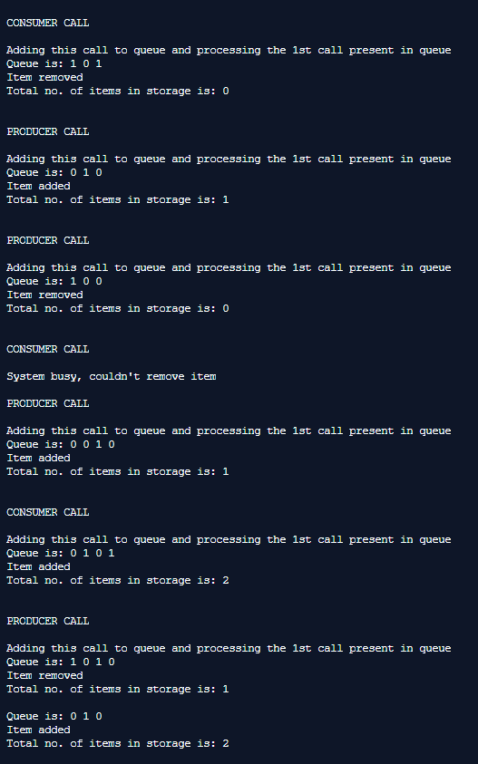

## Producer-Consumer Problem

-----------------------------------------
### Problem Definition:

A classic problem in concurrent programming is the Producer-Consumer problem. We have a data buffer, one or more producers of data that save it in the buffer and one or more consumers of data that take it from the buffer.

As the buffer is a shared data structure, we have to control the access to it using a synchronization mechanism such as the synchronized keyword, but we have more limitations. We need to ensure that when a producer is placing an item in the buffer, then at the same time consumer should not consume any item. In this problem, buffer is the critical section. A producer can't save data in the buffer if it's full and the consumer can't take data from the buffer if it's empty.

------------------------------------------
### Output:

    

    

    

