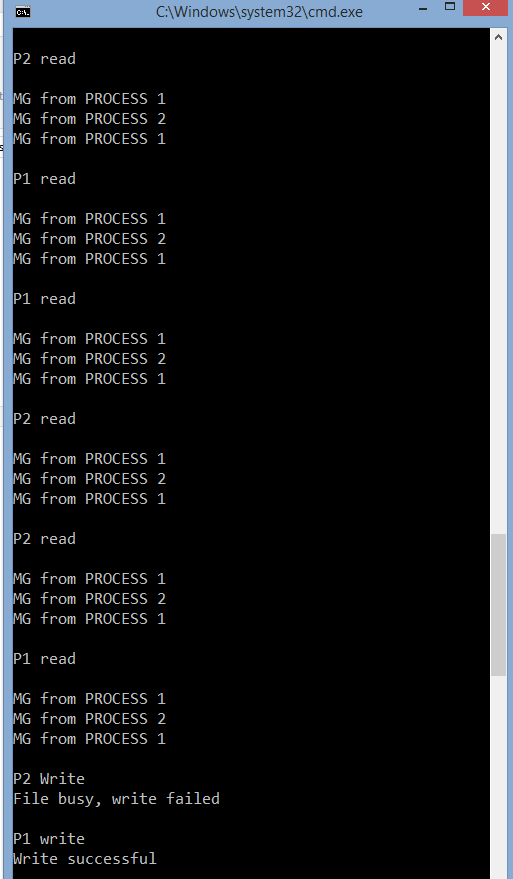
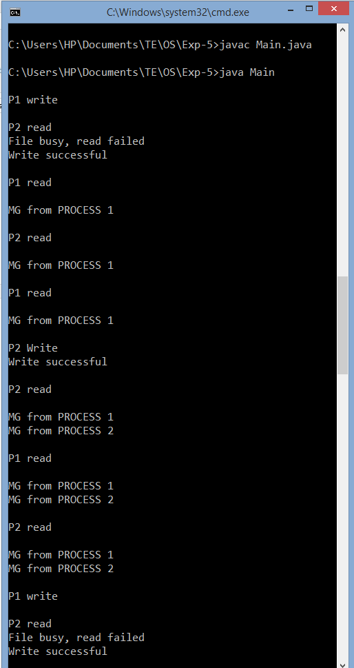
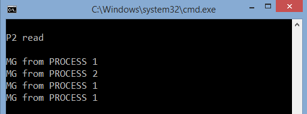

## Reader-Writer Problem

-----------------------------------------
### Problem Definition:

There is a shared resource which should be accessed by multiple processes. There are two types of processes in this context. They are reader and writer. Any number of readers can read from the shared resource simultaneously, but only one writer can write to the shared resource. 

When a writer is writing data to the resource, no other process can access the resource. A writer cannot write to the resource if there are non zero number of readers accessing the resource at that time. 

------------------------------------------
### Output:

    

    

    

    “Test.txt” after termination of program (Initially blank)

    

